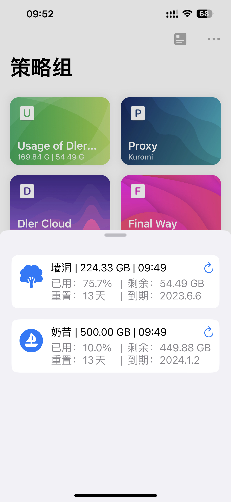
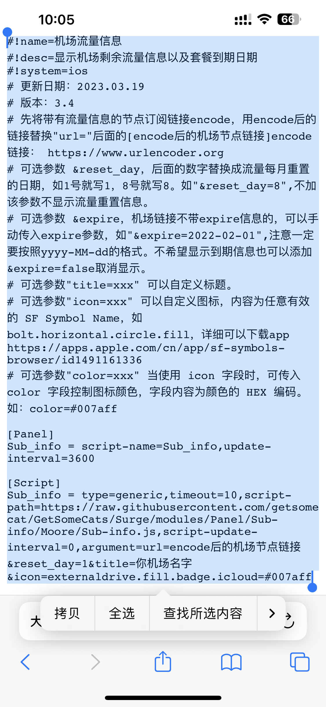
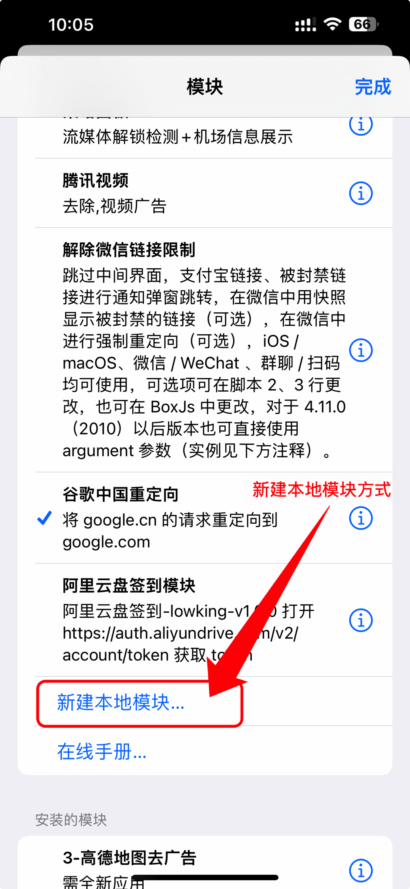
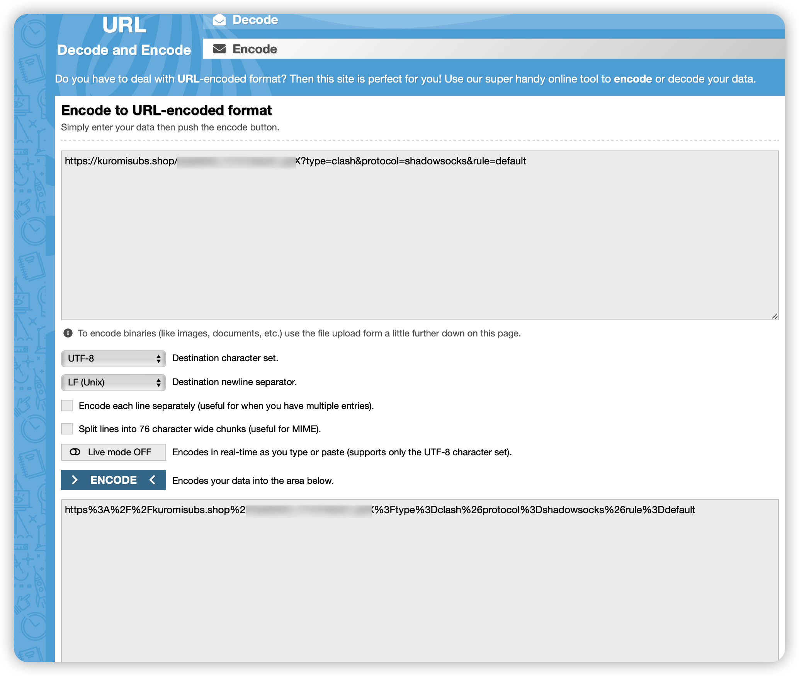
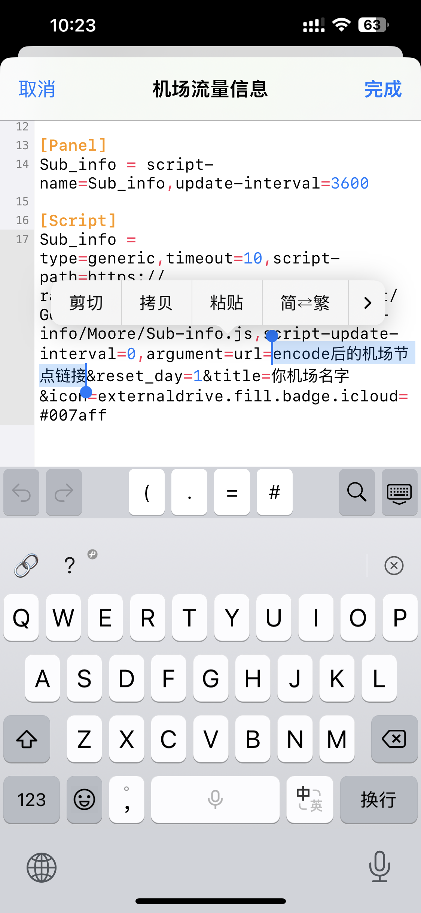
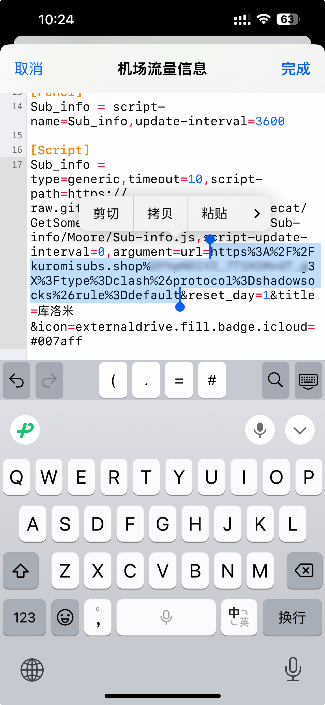
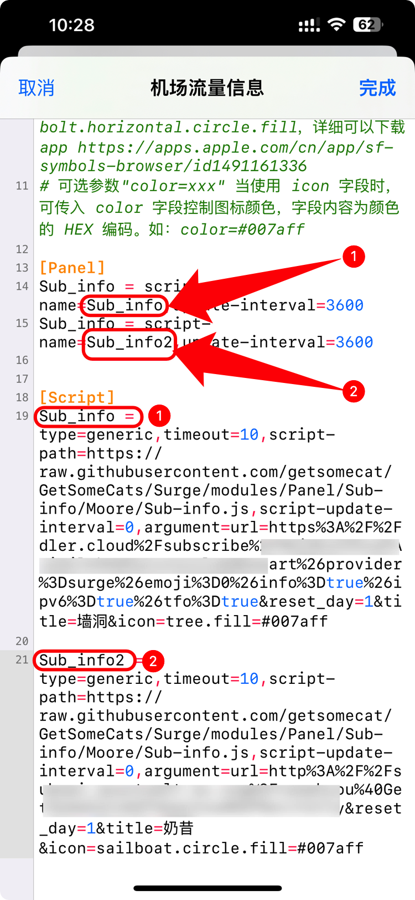
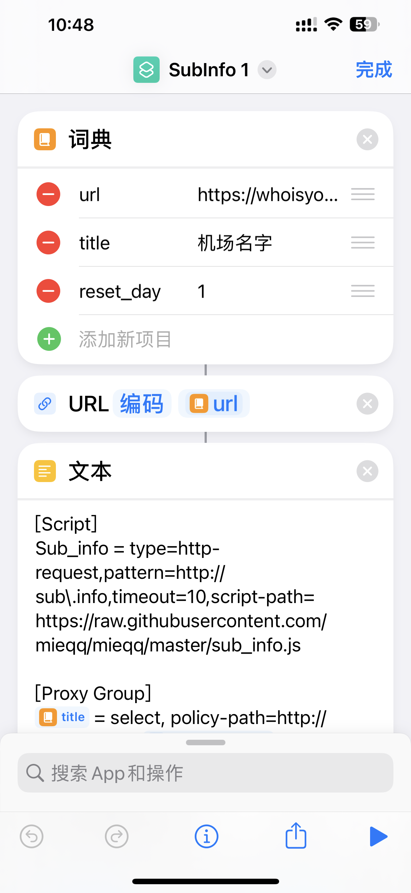

# 如何在panel/策略组中显示机场的到期时间和流量

经常有人问如同上图那种在surge的面板（panel）和策略组（proxy group）中显示机场的订阅的流量，到期日期等信息，也反复的教过好多次，在此也重新总结一下写一个教程。

## 功能
1. 查看你机场当前剩余的流量
2. 查看你机场购买套餐的流量
3. 查看你机场重置流量的日期
4. 查看你机场套餐到期的日期

## 如何实现
### 1.安装环境

需要有网络调试工具Surge，并且已经付费至面板功能（否则只能通过策略组方式）
最低支持版本 :

> AppStore 版 4.9.3 或更新版本
> TestFlight 版 4.11.0 (2014) 或更新版本

### 2.安装模块（面板方式）

首页->模块->新建本地模块，将下面👇链接**点开**后，将里面内容**全部复制粘贴**到**本地模块**中

`[https://raw.githubusercontent.com/getsomecat/GetSomeCats/Surge/modules/Panel/Sub-info/Moore/Sub-info.sgmodule](https://raw.githubusercontent.com/getsomecat/GetSomeCats/Surge/modules/Panel/Sub-info/Moore/Sub-info.sgmodule)`

### 3.将订阅链接encode

encode链接： 
[https://www.urlencoder.org](https://www.urlencoder.org)

> 为什么要encode？
> 1.是因为当字符串数据以url的形式传递给web服务器时,字符串中是不允许出现空格和特殊字符的。

> 2.因为 url 对字符有限制，比如把一个邮箱放入 url，就需要使用 urlencode 函数，因为 url 中不能包含 @ 字符。

> 3.url转义其实也只是为了符合url的规范而已。因为在标准的url规范中中文和很多的字符是不允许出现在url中的。

这里放一张encode前后对比截图就能知道encode的作用了。

### 4.将encode后的订阅链接替换本地面板里面相应字符

用encode后的链接替换"url="后面的[机场节点链接] -> 完成!

### 如果你有多个机场：
如果有多个机场，请按照下面截图的例子进行
图中1、2分别对应即可。

补充：有部份机场可能会按照如上操作但是获取不了流量信息，是因为有些订阅禁止用head访问，你试试在订阅后面加上 `&method=get`
最后，你也可以通过快捷指令的方式生成，再复制到本地模块中：

[https://www.icloud.com/shortcuts/af4420b253174e1a922938d63bd23d68]

## 通过策略组的方式显示：

策略组的方式相对比较简单，首先是通过快捷指令的方式：

[https://www.icloud.com/shortcuts/ad9ff961507049a0bbdd676b95265626]

将快捷指令安装好后，点右上角的三个小圆点，然后安装词典里面提示的填入相应信息，接着点右下角的运行按钮即可生成。

将生成的代码，按照字段复制到surge的相应字段里面即可

