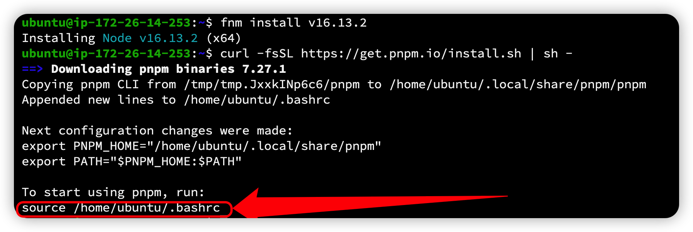

# 用VPS架设自己的Sub-store

**写在前面：十分感谢 小一 @xread 大佬帮忙在我VPS上亲自进行了一次部署，并且留下步骤说明！**

## 你需要的：
* 一台VPS，配置高点，不要太低。（一开始我开的甲骨文的1C1G的永远免费实例，小一大佬说编译过程中卡死失联了，后面查了下IP也被墙了，然后改成ARM的2+12上部署就很顺利）
* 一个域名，托管到cloudflare（其它地方也行，但是CF相对比较方便）
* 写本教程截图的是我后面重新开的 AWS lightsail（10刀/月，1C2G的配置三个月试用）上进行的，系统是ubuntu，并且按照大佬留下的命令步骤来一边部署，一边截图，如果你使用的其它家VPS可能会略微有点差别，请参照使用。

## 部署过程

### 1，域名设置

在cloudflare的域名DNS记录里面添加两个A记录，一个是`substore.domain.com`,一个是`subapi.domain.com` (实际A记录的名字随意，只要你能区分就行）
见下图例子：

备注：后面的代理黄云勾不勾随意，如果你用其它第三方ssl证书可以不勾，如果用CF的证书就勾上。

### 2，脚本的前端后端安装过程

#### 1，ssh登陆到vps后，对vps进行常规升级和更新：

Tip：我是在新开的主机上进行部署，所以有更新和安装过程，如果你上面已经安装有相关的可以跳过

```
sudo apt update -y 
```

#### 2，安装 `unzip wget git` 

```
sudo apt install unzip wget git -y
```
#### 3，下载和安装 fnm （Node.js版本管理器）

```
curl -fsSL https://fnm.vercel.app/install | bash

```

> **看上一步的提示复制粘贴 不要抄下面的**

#### 4，根据上一步提示执行命令：

```
source /home/ubuntu/.bashrc
```

#### 5，安装node.js

```
fnm install v16.13.2
```
#### 6，安装 PNPM 软件包管理器

```
curl -fsSL https://get.pnpm.io/install.sh | sh -
```


#### 7，根据上一步提示执行命令
> **看上一步的提示复制粘贴 不要抄下面的**

```
source /home/ubuntu/.bashrc
```


#### 8，创建Sub-store的安装文件夹并进入该文件夹

```
mkdir -p ~/Sub-Store

cd ~/Sub-Store

```
#### 9，下载前端页面压缩包并解压缩

```
wget https://github.com/xream/Sub-Store/releases/download/2.13.5-alpha/dist.zip -O frontend.zip

```
```
unzip frontend.zip

```


#### 10，将dist文件夹复制到相应目录，后面前端页面要用到

```
sudo cp -R dist /var/www/html/

```

> **注意：有些VPS如果直接执行上面操作会提示没有那个文件或者文件夹
> 解决办法是如上图所示切换到相应的目录去建立对应的文件夹然后再执行复制操作。**

#### 11，下载后端sub-store脚本

```
wget https://github.com/xream/Sub-Store/releases/download/2.13.5-alpha/sub-store.js -O sub-store-bundled.js
```


#### 12，创建sub-store服务

Tip：经测试发现使用pm2时因为[pid存在bug](http://github.com/soyuka/pidusage%20)，而导致服务在直接重启VPS时不会自动启动，故改为创建sub-store服务并设置成开机自动启动

编辑 /home/ubuntu/Sub-Store/sub-store.service 

**里面对应的路径要根据实际情况改**


```
vim /home/ubuntu/Sub-Store/sub-store.service

```


将以下内容复制进去，注意下里面的文件路径对应你自己的实际路径

```
[Unit]
Description=Sub-Store
After=network-online.target
Wants=network-online.target systemd-networkd-wait-online.service
[Service]
LimitNOFILE=32767 
Type=simple
User=ubuntu
Restart=on-failure
RestartSec=5s
ExecStartPre=/bin/sh -c ulimit -n 51200
ExecStart=/home/ubuntu/.local/share/fnm/fnm exec --using v16.13.2 node /home/ubuntu/Sub-Store/sub-store-bundled.js
WorkingDirectory=/home/ubuntu/Sub-Store/
[Install]
WantedBy=multi-user.target
```
将创建的服务加入到系统服务

```
sudo cp /home/ubuntu/Sub-Store/sub-store.service /etc/systemd/system/
```
重载服务：

```
sudo systemctl daemon-reload
```
设置成自动启动
```
sudo systemctl enable sub-store
```
启动服务：

```
sudo systemctl start sub-store
```
查看sub-store服务状态：

```
sudo systemctl status sub-store
```

### 3，安装设置nginx

#### 1，安装nginx

```
sudo apt install nginx -y
```
#### 2，编辑nginx配置

```
sudo vim /etc/nginx/sites-enabled/sub-store.conf
```

根据自己的前面域名设置将以下内容改好后复制进去并保存


```
server {
  server_name subapi.domaim.com;            //改成你自己的api域名
  listen        80;
  location /eWVOSn8esAtDJLgTWBIi4VKL/{      //API-token也要根据需要修改，尽量复杂
    proxy_pass http://127.0.0.1:3000/;
  }
}
server {
  listen 80;
  listen [::]:80;
  root /var/www/html/dist;
  index index.html index.htm;
  server_name substore.domain.com;        ////改成你自己的sub域名
  location / {
    try_files $uri $uri/ /index.html;
  }
}

```


#### 3,检查一下nginx的配置是否正确

```
sudo nginx -t
```


#### 4，重载nginx配置，使更改的配置生效

```
sudo nginx -s reload
```
#### 5，将端口放行

```
sudo iptables -P INPUT ACCEPT
sudo iptables -P FORWARD ACCEPT
sudo iptables -P OUTPUT ACCEPT
sudo iptables -F
sudo netfilter-persistent save
```
> tips：上述操作Oracle的VPS需要进行，可能一些不需要，自己根据情况进行使用
> nginx的配置文件没有进行ssl证书设置，请自行搜索教程添加（小一大佬也没加我也不懂


至此整个安装部署过程就已经结束了，访问你的sub-store的地址是：

```
http://substore.domain.com/?api=http://subapi.domain.com/api-token
```

如果没有出错的话：


再次提醒一下，因为目前没有验证，又是vps端的，如果别人知道你的地址相当于就能知道你的全部订阅了，所以api的设置请尽量复杂一点，然后别泄露给其他人
再一点目前发现可能有点问题的地方，添加到主屏幕后因为iOS的限制会无法使用，也就是只能Safari里面用了，这点我问过小一大佬，他说没啥办法解决，系统层面的限制
再次感谢小一大佬 @xread 热心帮助！推一下他的频道：https://t.me/zhetengsha_group 
